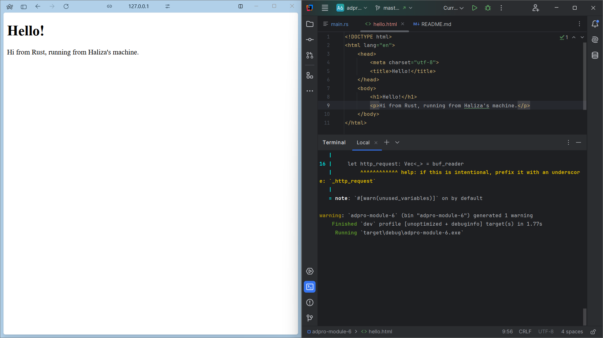
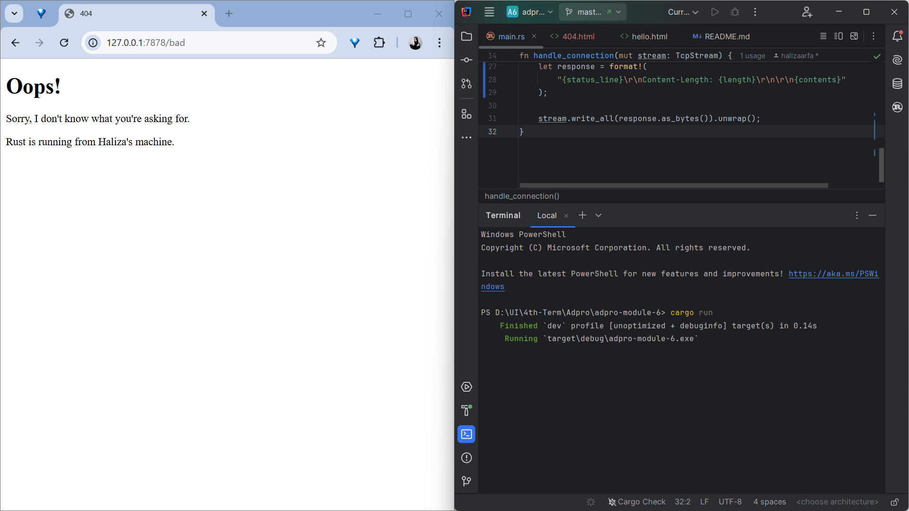

# Adpro - Tutorial 6
Haliza N. S. Arfa | 2306211401 | Adpro A

---

## Milestone 1: Single-Threaded Web Server
Dalam membuat single-threaded web server, terdapat dua protokol utama yang terlibat, yaitu
HTTP (Hypertext Transfer Protocol) dan TCP (Transmission Control Protocol).
Prinsip dari kedua protokol ini adalah request-response, artinya server menerima dan merespons request dari client.

TCP adalah protokol tingkat rendah yang menjelaskan bagaimana informasi berpindah dari suatu server ke server lainnya,
tetapi tidak menentukan apa informasi tersebut. HTTP berguna untuk menentukan konten request dan response.
Data dari HTTP ini dikirim melalui TCP.

Pada awalnya, program ini hanya mampu menerima koneksi browser request dengan menggunakan `TcpListener` ke alamat `127.0.0.1:7878`. Program akan mencetak "Connection established!" setiap kali koneksi tersebut diterima.
- `bind()`: Menghubungkan `TcpListener` dengan alamat dan port tertentu pada mesin lokal untuk didengarkan koneksinya.
- `unwrap()`: Mengekstrak nilai dari sebuah `Result` atau `Option`. Jika hasilnya adalah `Ok` atau `Some`, maka nilai yang terkandung di dalamnya akan dikembalikan. Namun, jika hasilnya adalah `Err` atau `None`, maka `unwrap` akan menyebabkan program mengalami panic dan berhenti, menunjukkan bahwa terjadi masalah yang serius.
- `incoming()`: Menerima koneksi yang masuk pada `TcpListener`. Ini mengembalikan sebuah iterator yang menghasilkan `Result<TcpStream, Error>`, di mana setiap elemen iterator tersebut adalah _stream_ yang mewakili koneksi terbuka antara client dan server. Kita dapat menerima koneksi secara berurutan dan menanganinya satu per satu.
 
Untuk menangani bagaimana server akan berperilaku ketika menerima request dari browser, dibuat method `handle_connection()`.
Console akan memberikan pesan HTTP (`http request`) di akhir method.
- `BufReader` membaca stream atau baris-baris dari `TcpStream` dengan metode `lines()`.
- `http_request` mengumpulkan baris-baris permintaan HTTP yang diterima dari browser.
- `println!("Request: {:#?}", http_request);` mencetak seluruh permintaan HTTP dalam format debug.

## Milestone 2: Returning HTML
Screenshot:


Fungsi `handle_connection` menggunakan `fs::read_to_string` untuk membaca konten dari file `hello.html` ke dalam sebuah string.
Hal tersebut berguna untuk mengirimkan konten HTML sebagai bagian dari respons yang dikirimkan kembali kepada user.

Setelah itu, buat respons HTTP dengan status line `"HTTP/1.1 200 OK"` dan header `Content-Length` yang menunjukkan panjang dari
konten HTML yang akan dikirimkan, dan menambahkan konten HTML sebagai badan (body) dari respons.

Selanjutnya, kita mengirimkan respons tersebut melalui stream TCP menggunakan metode `write_all`.

## Milestone 3: Validating Request and Selectively Responding
Screenshot:


Pada awalnya, web server selalu menampilkan `hello.html` apapun request-nya. Kali ini, kita menambahkan fungsionalitas untuk memeriksa
apakah browser meminta `/` sebelum mengembalikan file HTML. Jika permintaan tidak sesuai, kita akan mengembalikan respons dengan kode status `404` dan halaman error HTML yang sesuai.
Penerapan `404.html` mirip seperti `hello.html`.

```rust
 let request_line = buf_reader.lines().next().unwrap().unwrap();
 ```
- `.lines()`, mendapatkan iterator baris-baris dari `BufReader`.
- `.next()`, mendapatkan opsi pertama dari iterator tersebut.
- `unwrap()` pertama, mengeluarkan opsi yang mungkin (`Option`) dari `. next()`
- `unwrap()` kedua, mengeluarkan nilai yang mungkin (`Result`) dari hasil `.next()` tersebut.

Saya melakukan refactoring pada `main.rs` agar tetap sesuai dengan clean code. yaitu `DRY` (Don't Repeat Yourself).
Langkah yang saya lakukan yaitu mengeluarkan semua variabel yang sama pada blok `if-else`.
Sebelumnya, `contents` dan `status_line` didefinisikan spesifik untuk tiap blok `if` dan `else`. Hal ini menyebabkan variabel ini tidak dapat digunakan di luar cakupan tersebut.
Untuk itu, digunakan `let (status_line, contents) = ...` untuk menangani hal tersebut.

## Milestone 4: Simulation Slow Response
Di sini, disimulasikan respons lambat untuk web server.

Fungsi `thread::sleep` digunakan untuk menunda eksekusi program selama jangka waktu tertentu.
Digunakan juga `match` untuk memeriksa baris request yang diterima dari klien.

Jika request-nya adalah `"GET /sleep HTTP/1.1"`, server akan melakukan sleep selama 5 detik sebelum memberikan respons.
Ini mensimulasikan respons lambat yang akan mempengaruhi permintaan lain ke server.

Dibuka dua windows dengan masing-masing endpoint
`/` dan `/sleep`. Pada situasi biasa, reload endpoint `/` akan berlangsung dengan cepat dan langsung. Namun, jika me-reload `/` setelah `/sleep`,
terlihat bahwa `/` menunggu sampai endpoint `sleep` selesai melakukan sleep selama 5 detik.

## Milestone 5: Multithreaded Server
Pada tahap ini, web server diubah dari single-threaded menjadi multi-threaded. `ThreadPool` digunakan untuk  mengelola sejumlah thread
yang tersedia untuk menangani task yang masuk. Pada contoh ini, awalnya `ThreadPool` hanya menyimpan `Worker` yang merupakan struktur yang berisi `JoinHandle<()>` untuk masing-masing thread.

Untuk membuat implementasi multithreaded, `ThreadPool` diperbarui sehingga menyimpan vektor dari `Worker`. Setiap `Worker` memiliki id yang unik dan sebuah thread
yang diinisiasi dengan closure kosong. Pada saat pembuatan `ThreadPool`, sebuah channel juga dibuat di mana sender disimpan pada `ThreadPool` dan receiver disalin ke setiap `Worker`.
Closure yang diterima oleh `execute` kemudian dikirim melalui sender channel untuk dieksekusi oleh salah satu thread yang tersedia.
`Worker` akan terus meminta tasks dari receiver channel dan menjalankannya dalam loop menggunakan `mutex` untuk menghindari race condition.

Dengan implementasi ini, `ThreadPool` dapat secara efisien menangani banyak tasks secara concurrency untuk menjaga jumlah thread yang sesuai agar meminimalkan overhead.
Channel juga digunakan untuk menyampaikan tasks secara aman di antara thread yang tersedia.

## Referensi
[Final Project: Building a Multithreaded Web Server](https://rust-book.cs.brown.edu/ch21-00-final-project-a-web-server.html)